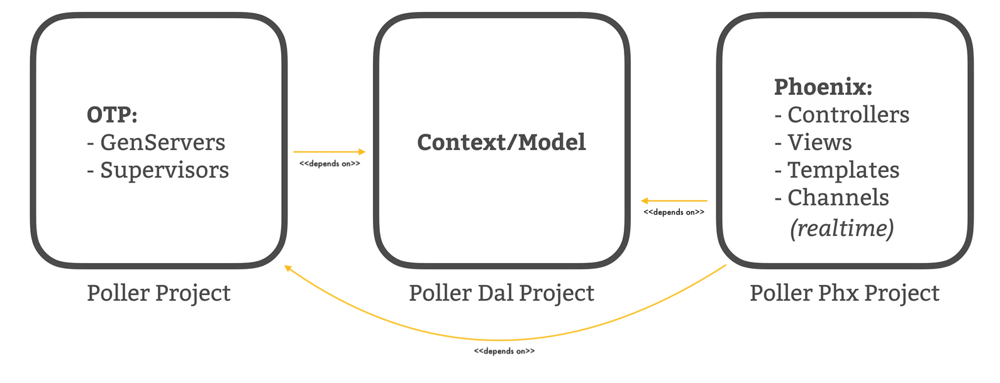

# Exit Polling [Back-end] app
This app was presented as a PoC material, to convince teams to switch to Elixir (a functional, concurrent, high-level general-purpose programming language for creating low-latency, distributed, and fault-tolerant systems) and Phoenix framework.

## For whom is this project ?
This can be used by anyone wanting to know more about Elixir/Phoenix, React latest features or showcase Elixir/Phoenix capabilities to convince their own teams 😉.

## About the project
This project is a Full-stack app, where users can perform **real-time** election day exit polling and displaying the result in **real-time**. This repo represents the back-end part of the app.

### Features
- Before election day, an admin user can:
  1. add and maintain districts that they intend on conducting exit polling in.

  

  2. add and maintain the questions; related to specific district; they want to ask voters.

  

  3. add and maintain the possible choices they want voters to choose from when performing a vote to a question specific to a ditrict.

  

- On election day:
  - logged users dispatched across various polling stations:
    1. open the app and sign-in using an already created account.
    2. choose the corresponding district.
    
    

    3. when a voter is presented to the station, who's willing to participate in the Exit poll for that district:
        - they click on start poll for that district.
        
        

        - all questions related to that district are presented one after the other, along with their corresponding choices.
        - they can vote by picking a choice among choices of the currently presented question.

        

  - any user of the app can:
    1. open Poll results of a district
      
      

    2. get votes count of question' choices related to the choosen district in **real-time**
      
      

      
### Architecture
Since databases are almost the bottleneck in an application, the Exit polling app is designed in a way that minimizes the usage of the database, thus minimizing the likelihood that database becomes the performance bottleneck in the application. 

The application is an umbrella mix project with 3 sub-projects:



The GenServers(PollServers) communicate with Channel processes using Pub/Sub pattern:


## Sub-projects
### Poller project:
It maintains in-memory state; districts, their questions, their choices, and real-time choices' votes; for the app. 

When an Exit poll is conducted, the vote results of the poll is stored in a **PollServer(GenServer)**. Each district' poll is maintained by a **PollServer(GenServer)** instance; a **PollServer** stores a district' poll related struct.
Each **PollServer** instance periodically saves its poll' choices votes to the database. <u>The **Poller project** still interact with the database via **PollerDal project** , but in a way that minimizes the risk of overwhelming the database.</u>

**PollSupervisor** behaves as **DynamicSupervisor**, and starts new PollServer instances on-demand by calling **start_poll/1** public function.


**PollServers(GenServer)** and **PollSupervisor(Supervisor)** allow the app to be very ***responsive***, ***efficient***, and ***highly-concurrent***, because we're storing polling data in-memory which is orders of magnitude faster than having to constantly interact with the database.

Note: *Questions and choices data need to be set before election day in a database (except for votes).*

#### Dependencies:

The Poller project needs PubSub lib, to broadcast choice' votes update event when a vote is performed.

#### Why not using Phoenix default PubSub instance ?

Indeed, the PollerPhx project already has a default PubSub instance in its application supervision tree. This instance is used internally by phoenix and we could use it if we decided to broadcast the votes update event from the PollerPhxWeb.ChoiceController.vote/2 action using PollerPhxWeb.Endpoint.broadcast/3 like so:

  ```Elixir
  # within PollerPhxWeb.ChoiceController.vote/2 controller' action
  PollerPhxWeb.Endpoint.broadcast!(
    "district:" <> Integer.to_string(district_id),
    "district_votes_update",
    %{choice_id: choice_id, votes: poll.votes[choice_id]}
  )

  # within PollerPhxWeb.ResultChannel
  @impl true
  def handle_info({"district_votes_update", choice_id, votes}, socket) do
    # ... here we hande the broadcasted message
  end
  ```

But, our design decision regarding Publishing/Subscribing votes changes is biased towards PollServers, which represent the source of truth. So, a choice' votes updated event is broadcasted from the corresponding PollServer as a result of a user vote, initiated by PollerPhxWeb.ChoiceController.vote/2 action. This is done by the "phoenix_pubsub" lib.


### Poller DAL (Data Access Layer) project:
It contains context/model related logic, which is mostly responsible for interacting with the database.

It is heavily-based on Ecto (Functional-Relational Data Access) library to interact with the Postgres database and define/set changesets allowing to filter, cast, validate changes, and transform database constraints into errors, before applying them to user-data.

It's used by:
  1. **PollerPhx project** - to access data when RESTful endpoints are hit.
  2. **Poller project** - to:
      - get questions and their corresponding choices on **PollServer(GenServer)** init/startup.

      - save periodically in-memory poll' choices votes (maitained on **PollServer/GenServer**) to the database.


### Poller Phx (Phoenix) project:
It contains RESTful endpoints (controllers, actions), authentication Plugs/Pipelines, views (JSON encoders/decoders), and Phoenix channels for **real-time** voting.

#### Design decisions:
##### Fetching & Loading references/entities:
We decided to reference resources using links/hrefs 
instead of providing just an Id which should be opaque (not be used consumer-side to construct resource URI).

Another alternative would be the introduction of "_expand" query param:
`GET RESOURCE_URL?_expand=*` to expand all relations or `GET RESOURCE_URL?_expand=RELATION_NAME` to expand a specific relation.<br/>
As a reminder, we prefix the query param with underscore if it is not a state/attribute related to the resource.

#### Dependencies:
  1. Poller project - to:
      - start up PollServer(GenServer) of the corresponding district, by using the PollerSupervisor(DynamicSupervisor).
      - relay vote requests to their corresponding PollServer(GenServer), according to the vote request' district data.
      - get latest votes data, when a user joins a district' channel for **real-time** poll resutls.

  2. PollerDal project - to interact with the Postgres database

  3. Guardian lib - a simple yet powerful token-based authentication library

  4. corsica lib - to deal with CORS(Cross-Origin Resource Sharing) requests and responses
      - it provides a plug out of the box that handles CORS requests and responds to preflight requests

  5. argon2_elixir lib - a Argon2 password hashing implmentation for Elixir


## How about scaling ?
Many years ago, the Phoenix team decided to benchmark their channels abstraction and they were able to reach **two million connections on a single node**. So the app scales well vertically (i.e., on powerful machines). However, for horizontal scaling, we need to rethink and refactor how we're addressing, starting, stopping PollServers(GenServers). 

Rest assured, Elixir and the BEAM offer native support for clustering. In other words, clustering is a first-class feature in Elixir/Erlang, that was supported from the very beginning. So scaling vertically will be not cumbersome as well.


## Getting started

To start your Phoenix server:

  * Install dependencies with `mix deps.get`
  * Start Phoenix endpoint with `mix phx.server`

Now you can visit [`localhost:4000`](http://localhost:4000) from your browser.

Ready to run in production? Please [check our deployment guides](https://hexdocs.pm/phoenix/deployment.html).

### Generated using:
  `$ mix phx.new poller_phx --no-ecto --no-html --no-webpack`


## Credits:
Thanks to:
  - [Elixir](https://elixir-lang.org/) team,
  - [James Moore knowthen](https://knowthen.com/category/elixir-and-phoenix-for-beginners/) for his course "Elixir and Phoenix For Beginners" and materials for this project,
  - [Phoenix framework](https://www.phoenixframework.org/) team,
  - [Ecto framework](https://hexdocs.pm/ecto/Ecto.html) team,
  - [Guardian lib](https://github.com/ueberauth/guardian) team,
  - And everyone who helped me in this journey.
  

<br/>

---
<p align="right">Written with Love ❤️</p>
